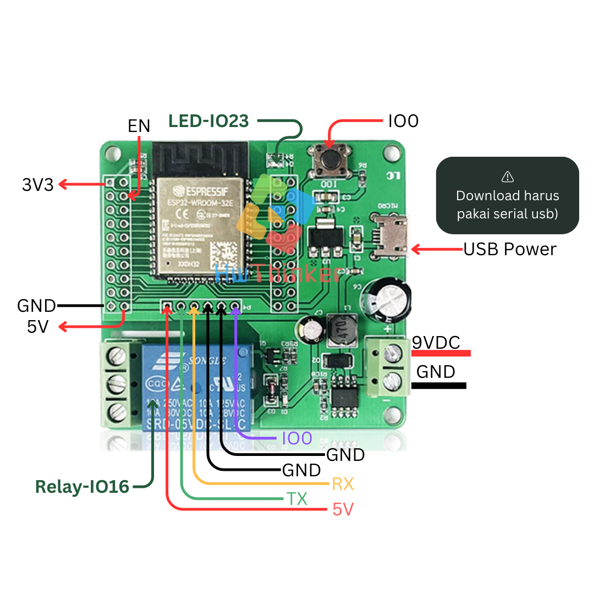
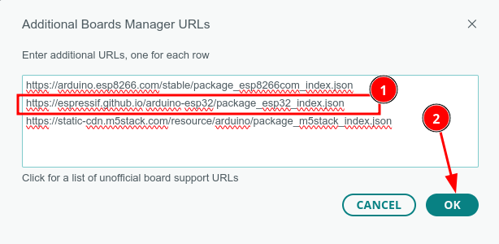
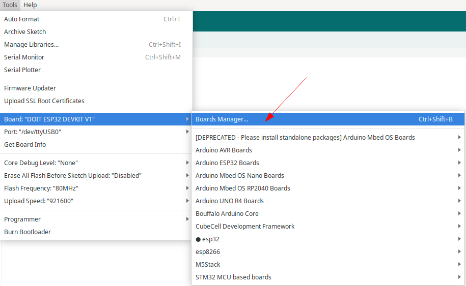
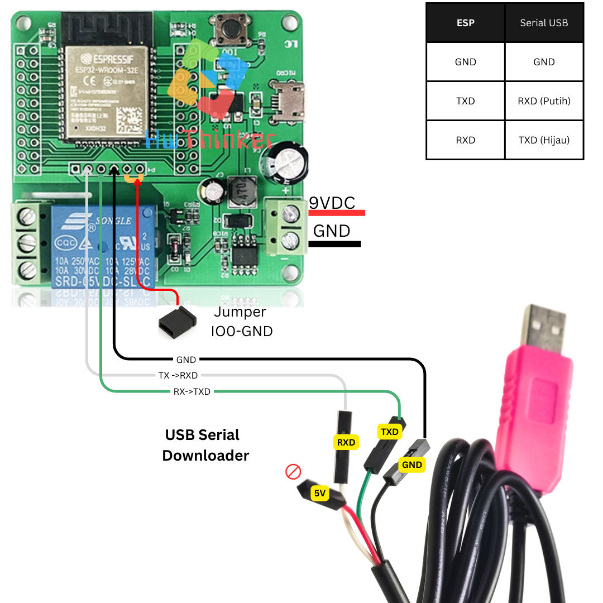
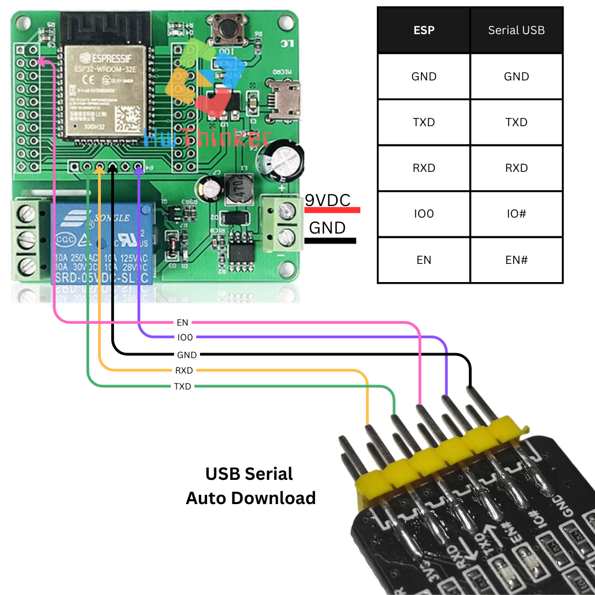

# Modul ESP32 Relay 1 Channel

<!-- hwthinker-store-links -->

## Beli boardnya & tutorial lengkap

**Board yang dipakai di repo ini tersedia di HwThinker Store:**

- [Modul ESP32 with Relay 10A 1 Channel ch 1ch WIFI Bluetooth WROOM-32E](https://hwthinker.com/produk/a0190886-8b6d-4eef-8f43-1f073764fd8b)

**Tutorial lengkap — langkah bergambar, troubleshooting, dan kode yang sudah diuji:**

- [Modul ESP32 Relay 1 Channel — Setup Arduino IDE dan Kontrol Relay](https://hwthinker.com/tutorials/esp32-relay-1ch)

Butuh bantuan pemasangan? Sapa kami lewat live chat di [hwthinker.com](https://hwthinker.com) — barang dikirim dari Surabaya, sudah diuji sebelum dikemas.

<!-- /hwthinker-store-links -->




Board ESP32 (WROOM-32E) dengan satu relay 10A onboard — cocok untuk kontrol beban AC/DC sederhana (lampu, pompa, solenoid) lewat WiFi/Bluetooth bawaan ESP32. Relay dikendalikan lewat GPIO 16.

## Cara install plugin Arduino IDE

### Langkah 1: Buka Arduino IDE

1. Buka aplikasi Arduino IDE di komputer Anda. Jika belum ada, unduh dan instal Arduino IDE dari situs resmi Arduino di https://www.arduino.cc/en/software. disarankan menggunakan arduino ide versi 2

### Langkah 2: Tambahkan URL Board Manager untuk ESP32

2. Di Arduino IDE, buka **File** > **Preferences**.

   

3. Pada bagian  Additional Boards Manager URLs, tambahkan URL berikut:

```
https://espressif.github.io/arduino-esp32/package_esp32_index.json
```

4. Jika sebelumnya Anda sudah memiliki URL lain di sana, pisahkan URL ini dengan tanda koma atau baris baru.



### Langkah 3: Buka Boards Manager

1. Buka **Tools** > **Board** > **Boards Manager**.



2. Di kotak pencarian, ketik **ESP32**.

### Langkah 4: Instal Board ESP32

1. Temukan **ESP32 by Espressif Systems** di daftar, kemudian klik **Install**.


2. Tunggu hingga proses instalasi selesai.

### Langkah 5: Pilih Board ESP32

1. Setelah instalasi selesai, Anda dapat memilih board ESP32.
2. Buka **Tools** > **Board**, dan gulir ke bawah untuk menemukan berbagai jenis board ESP32 yang telah diinstal. Pilih board yang sesuai, misalnya **ESP32 Dev Module** 


3. hasilnya kurang lebih seperti ini


### Langkah 6: Pilih Port

1. Sambungkan board ESP32 ke komputer Anda menggunakan kabel USB.
2. Di **Tools** > **Port**, pilih port yang sesuai dengan ESP32 Anda.

## Contoh Program

Berikut adalah contoh kode sederhana untuk menguji relay:

```c++
#include <Arduino.h>

#define RLY1 16
#define LED 23
// the setup function runs once when you press reset or power the board
void setup() {
  // initialize digital pin LED_BUILTIN as an output.
  pinMode(RLY1, OUTPUT);
  pinMode(LED, OUTPUT);
}

// the loop function runs over and over again forever
void loop() {
  digitalWrite(RLY1, HIGH);  // turn the LED on (HIGH is the voltage level)
  delay(1000);                      // wait for a second
  digitalWrite(RLY1, LOW);   // turn the LED off by making the voltage LOW
  delay(100);    
  
  digitalWrite(LED, HIGH);  // turn the LED on (HIGH is the voltage level)
  delay(1000);                      // wait for a second
  digitalWrite(LED, LOW);   // turn the LED off by making the voltage LOW
  delay(100);                   // wait for a second
}
```

## Cara Upload dengan Serial USB biasa



- Pasang serial USB TTL dengan ketentuan: 
   - TX -> RX USB Serial (Kabel Putih)
   - RX -> TX USB Serial (Kabel Hijau)
   - GND -> GND USB Serial (Kabel Hitam)
- Pastikan supply 9VDC dihubungkan pin VCC; GND Power supply -> GND
- pasang Jumper untuk menghubungkan IO0 terhubung GND
- Cabut dan pasang power supply untuk mengaktikan mode download.
- Download program dan tunggu sampai selesai
- lepas jumper
- Cabut dan pasang power supply (jumper harus di lepas) untuk run-program
- ulang langkah awal bila melakukan download ulang lagi


## Cara download dengan Serial USB auto Download

- Pasang serial USB TTL dengan ketentuan:
    - RX Board  -> RX USB Serial  
    - TX Board  -> TX USB Serial 
    - GND Board -> GND USB Serial  
    - IO0 Board -> IO# USB Serial 
    - EN Board  -> EN# USB Serial
- Pastikan supply 9VDC dihubungkan pin VCC; GND Power supply -> GND
- Download program dan tunggu sampai selesai

>[!Warning]
>Anda dapat memilih untuk menggunakan power supply dari salah satu konektor berikut: konektor Micro USB atau konektor Power (berwarna hijau). Namun, Anda tidak bisa menggunakan kedua konektor secara bersamaan."


>[!NOTE]
>Untuk serial disarankan menggunakan modul USB-TTL yang mendukung "auto download" — otomatis mengatur EN/IO0 saat upload sehingga tidak perlu pasang-lepas jumper manual tiap kali upload.


## Pemecahan Masalah

### A. Port Com tidak dapat dikenali di Arduino

Masuk ke mode unduh:

- Tekan dan tahan tombol Boot/0
- Klik(tekan dan lepas) tombol reset/EN sambil tetap tekan tombol Boot .
- Lepas tombol boot
- Setelah selesai Wajib klik tombol **reset** sekali lagi untuk berpindah dari mode download menjadi mode run

### B. Program tidak dapat berjalan setelah diunggah

Setelah upload berhasil, Anda perlu menekan tombol Reset sebelum dapat dijalankan.

